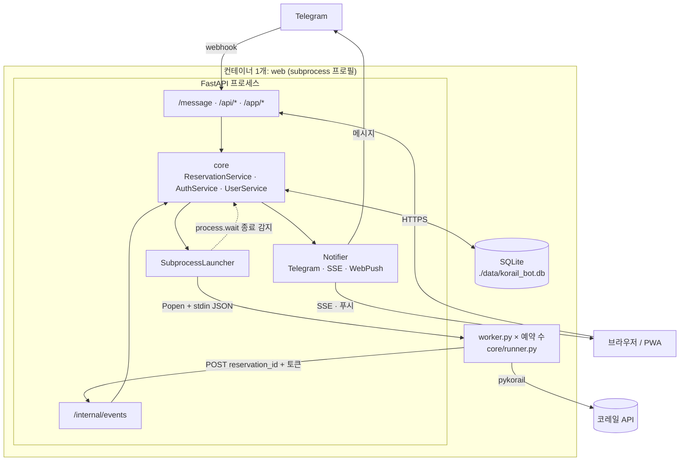
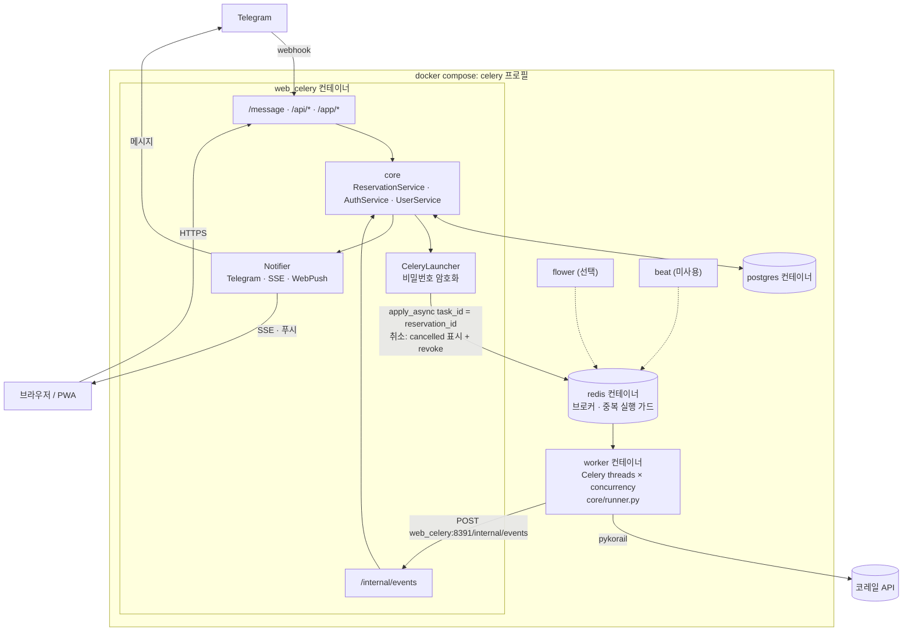

# 실행 모드별 처리량 검토 (Subprocess vs 메시지큐)

| 항목 | 내용 |
|---|---|
| 작성일 | 2026-09-26 (KST) |
| 측정일 | 2026-09-26 (KST) |
| 대상 커밋 | `13e8b1d` (pykorail 병합 + 워커 경량화 이후) |
| 갱신 | 2026-09-26: 예약 생성 지연·고아 워커 수정 결과 추가 (4.5절, 5절, 7절) 2026-09-27: Celery 기본 풀을 threads로 전환, 협력 취소 적용 (1절, 5절, 6절, 7절, 8절) |

> 수치는 측정 당시 코드와 환경 기준입니다. 워커 구조, 코레일 클라이언트(pykorail) 버전, 서버 사양이 바뀌면 다시 측정해야 합니다.

## 1. 결론 요약

- **Subprocess 모드로 개인 서버·소규모 그룹 운영에 충분합니다.** 한계는 CPU가 아니라 메모리이며, 예약 1건당 약 **22MB**(PSS)가 듭니다.
- 동시 예약 200건에서도 CPU는 코어 1개의 **6.8%**, 재시도 간격은 설계값(2초 + 응답 시간)대로 유지되고, API 응답 지연도 변하지 않았습니다.
- 웹 서버(단일 프로세스, SQLite)는 워커 보고를 초당 230~370건 처리합니다. 예약 200건에 필요한 양은 초당 약 1.4건이라 **병목이 아닙니다.**
- 메시지큐(Celery) 모드는
  - **threads**(2026-09-27부터 기본값): 200건에 125MB로 매우 가볍습니다. 강제 종료는 안 되지만 Redis 취소 표시를 매 시도 전에 확인하도록 바꿔 **취소 후 1초 안에 멈춥니다**(아래 5절).
  - **prefork**(`CELERY_POOL=prefork`): Subprocess보다 메모리를 더 쓰고, 예약이 없어도 슬롯 수만큼 미리 점유합니다. (전환 전에는 동시 실행 수 기본값이 CPU 코어 수라서 2코어 서버에서 동시에 2건만 실행됐습니다. 지금은 두 풀 모두 `MAX_CONCURRENT_RESERVATIONS`를 따릅니다.)
- **두 모드의 실제 한계는 코레일입니다.** 예약 200건이면 IP 하나에서 초당 약 74건을 요청하므로, 서버 자원보다 코레일의 매크로 차단(-2000)에 먼저 걸릴 가능성이 높습니다. 메시지큐의 실질적인 장점은 워커를 **여러 서버(여러 IP)로 나눌 수 있다**는 점입니다.

**권장:** 원래 목적(각자 서버에서 가볍게 운영)에는 Subprocess 모드를 기본으로 쓰고, 메시지큐는 여러 서버로 부하를 나눌 필요가 있을 때만 사용합니다.

## 2. 서버 크기별 동시 예약 수 (Subprocess 모드)

OS와 웹 서버 몫으로 약 350MB를 빼고 예약 1건당 22MB로 계산한 값입니다.

| 서버 RAM | 동시 예약 수 (약) |
|---|---|
| 1GB | 30 |
| 2GB | 75 |
| 4GB | 170 |

현재 기본값 `MAX_CONCURRENT_RESERVATIONS=10`이 이보다 먼저 막으므로, 서버 RAM에 맞춰 올리는 것을 권장합니다. 예약 하나는 최대 1000회(약 45분) 시도 후 종료되므로, 동시 슬롯 하나로 하루에 수십 건의 예약 작업을 처리할 수 있습니다.

## 3. 측정 방법

| 항목 | 내용 |
|---|---|
| 환경 | 4코어 / 16GB 컨테이너, Python 3.13 |
| 웹 서버 | 실제 FastAPI 앱 (`web.factory.create_app`), uvicorn 단일 프로세스, SQLite 파일 DB |
| 워커 | 실제 `telegramBot.worker` / `reservation_task` + `core/runner.py`, 운영 설정(간격 2초, 1000회, 측정 당시 50회마다 보고 → 현재 20회) |
| 코레일 | 모의 서버: 응답 지연 0.7초, 열차 20개 JSON(약 8KB). 워커는 pykorail과 같은 curl_cffi 세션(브라우저 위장 포함)으로 호출 |
| 부하 | 사용자별 로그인 후 예약을 단계적으로 증가(동시 요청) → 모두 `running`이 된 뒤 45초간 측정 |
| 동시 측정 | 20개 클라이언트가 10초간 `GET /api/reservations` 반복, 100개 SSE 연결 유지 |
| 메모리 | 워커 프로세스들의 PSS 합계(공유 메모리를 나눠 계산) 및 RSS 합계 |

실제 코레일은 부하 대상에서 제외했습니다. 2026-09-26에 pykorail로 실제 열차 조회를 확인한 결과 응답 시간은 약 0.7초였습니다(이 환경의 프록시 경유, 첫 요청은 역 목록 조회 포함 약 3초). 실제 코레일 응답의 파싱·TLS 비용과 코레일의 요청 제한은 측정하지 않았습니다.

## 4. 결과

### 4.1 Subprocess 모드

| 동시 예약 | 워커 PSS 합계 | 워커 RSS 합계 | 워커 CPU (코어 1개 기준) | 초당 조회 | 평균 재시도 간격 | 전체 시작 시간 | 예약 생성 p95 | API p95 |
|---|---|---|---|---|---|---|---|---|
| 10 | 227MB | 372MB | 0.3% | 3.6 | 2.82초 | 1.3초 | 0.7초 | 118ms |
| 50 | 1,086MB | 1,861MB | 1.6% | 18.0 | 2.78초 | 2.8초 | 2.2초 | 120ms |
| 100 | 2,156MB | 3,723MB | 3.6% | 36.7 | 2.72초 | 3.6초 | 2.8초 | 129ms |
| 200 | 4,297MB | 7,444MB | 6.8% | 73.7 | 2.71초 | 8.9초 | 8.0초 | 130ms |

- 웹 서버 RSS는 115~130MB로 거의 변하지 않았습니다.
- 200건 일괄 취소는 2.6초가 걸렸고, 취소 후 남은 워커 프로세스는 0개였습니다.
- "예약 생성 p95"는 해당 단계의 예약을 **한꺼번에** 요청했을 때의 값입니다. 요청이 몰리면 느려지는 원인과 수정 결과는 4.5절을 참고하세요.

**워커 경량화 전후 비교** (모두 2026-09-26 측정, 경량화 전은 커밋 `963c20e`에서 코레일 지연 0.25초로 측정):

| 동시 예약 | 경량화 전 PSS | 경량화 후 PSS |
|---|---|---|
| 10 | 650MB | 227MB |
| 50 | 3,172MB | 1,086MB |
| 100 | 6,321MB | 2,156MB |

경량화 전에는 `telegramBot/__init__.py`가 봇 모듈을 import해서, 워커마다 python-telegram-bot·설정·httpx까지 로드했습니다(워커 1개 약 86MB → 약 30MB, 커밋 `13e8b1d`).

### 4.2 Celery prefork (concurrency 100)

| 동시 예약 | 워커 PSS 합계 | 워커 RSS 합계 | 워커 CPU | 초당 조회 | 평균 재시도 간격 | 예약 생성 p95 | API p95 |
|---|---|---|---|---|---|---|---|
| 10 | 3,341MB | 6,317MB | 0.6% | 3.6 | 2.82초 | 0.5초 | 113ms |
| 50 | 3,435MB | 6,541MB | 2.3% | 17.8 | 2.82초 | 0.6초 | 123ms |
| 100 | 3,552MB | 6,820MB | 4.0% | 35.6 | 2.81초 | 0.7초 | 124ms |

- 예약 수와 관계없이 슬롯 100개만큼 메모리를 미리 점유합니다(프로세스 101개).
- 100건 기준 Subprocess(2.16GB)의 약 1.6배이며, 여기에 Redis와 PostgreSQL 컨테이너가 추가됩니다.
- 예약 생성은 큐에 메시지만 넣으므로 요청이 몰려도 빠릅니다.

### 4.3 Celery threads (concurrency 200)

| 동시 예약 | 워커 PSS | 워커 RSS | 워커 CPU | 초당 조회 | 평균 재시도 간격 | 예약 생성 p95 | API p95 |
|---|---|---|---|---|---|---|---|
| 10 | 72MB | 89MB | 0.6% | 3.6 | 2.82초 | 0.5초 | 118ms |
| 50 | 85MB | 102MB | 2.5% | 18.6 | 2.69초 | 0.5초 | 129ms |
| 100 | 98MB | 116MB | 4.8% | 35.6 | 2.81초 | 0.5초 | 127ms |
| 200 | 125MB | 142MB | 9.3% | 74.7 | 2.68초 | 1.1초 | 124ms |

- 프로세스 1개로 동작하며 예약 1건당 추가 메모리는 약 0.3MB입니다.
- 한 프로세스에 모든 예약이 들어 있으므로, 프로세스가 죽으면 진행 중인 예약이 모두 중단됩니다.

### 4.4 웹 서버 워커 보고 처리량

`/internal/events`에 진행 보고(DB 갱신 + 알림)를 동시에 보낸 결과입니다.

| 동시 요청 | 초당 처리 | p50 | p95 |
|---|---|---|---|
| 10 | 372 | 26ms | 41ms |
| 50 | 229 | 148ms | 644ms |

측정 당시 예약 1건은 50회 시도(약 2분 20초)마다 보고해 동시 예약 200건에 필요한 처리량이 초당 약 1.4건이었습니다. 고아 워커를 빨리 멈추도록 보고 주기를 20회(약 1분)로 줄인 뒤에도 초당 약 3.6건으로, 처리 능력에 비해 충분히 작습니다.

### 4.5 동시 예약 생성 지연 (2026-09-26 수정 전후)

예약 100건을 한꺼번에 생성하면서, 그동안 `/health` 응답 지연으로 이벤트 루프가 막히는지 함께 측정했습니다(각 2~3회 반복한 범위).

| 단계 | 생성 p95 | 100건 완료 | `/health` p50 | `/health` 최대 |
|---|---|---|---|---|
| 수정 전 (`13e8b1d`) | 5.2~5.5초 | 5.3~5.6초 | 457~905ms | 1.6~2.1초 |
| + 생성 작업을 스레드로 (`asyncio.to_thread`) | 5.7~6.2초 | 5.9~6.4초 | 9~17ms | 0.8~1.9초 |
| + SQLite WAL | 5.1~5.4초 | 5.4~5.5초 | 53~90ms | 0.25~0.53초 |
| 참고: 워커 대신 `sleep` 실행 | 0.8~1.0초 | 0.9~1.1초 | 4~5ms | 64~69ms |

- **다른 요청이 멈추던 문제는 해결됐습니다.** 수정 전에는 생성 요청이 몰리는 동안 단순 요청도 최대 2초씩 기다렸습니다.
- 예약 1건 생성 비용 중 SQLite 커밋이 37ms를 차지했는데(기본 DELETE 저널 모드는 커밋마다 디스크 동기화), WAL 적용 후 4ms로 줄었습니다.
- 워커 대신 아무 일도 하지 않는 `sleep`을 실행하면 100건이 약 1초에 끝납니다. 즉 **서버의 생성 경로는 충분히 빠르고**, 남은 지연은 **워커 프로세스 100개가 동시에 시작하며 쓰는 CPU**(1개당 약 0.2~0.3초, 4코어 기준 합계 5~7초) 때문입니다. 예약마다 프로세스를 띄우는 방식의 구조적 비용입니다.
- 워커의 CPU 우선순위를 낮추는 방법(`nice 10`)도 시험했지만 효과가 없었습니다(p95 5.3초).
- 개인 서버에서 100건이 동시에 생성되는 경우는 드뭅니다. 필요하면 워커 모듈을 미리 로드해 두고 복제하는 방식(forkserver)으로 시작 비용을 줄일 수 있습니다(8절).

## 5. Celery threads 풀의 취소 문제

threads 풀은 `revoke(terminate=True)`를 지원하지 않습니다.

- 200건을 일괄 취소하자 DB에는 모두 `cancelled`로 기록됐지만, 이후 15초 동안 코레일 조회가 초당 76건으로 **취소 전과 같이 계속**됐습니다.
- Celery 로그: `NotImplementedError: <class 'celery.concurrency.thread.TaskPool'> does not implement kill_job`

**2026-09-26 수정 후:** 워커가 진행 보고에서 "이미 종료된 예약"(`applied: false`) 응답을 받으면 스스로 멈추도록 바꿨습니다(7절). 이제 threads 풀에서도 취소된 예약이 다음 진행 보고(최대 20회, 약 1분) 때 멈춥니다.

| 취소 후 구간 | 0~10초 | 10~20초 | 20~30초 | 30~40초 | 40초 이후 |
|---|---|---|---|---|---|
| 코레일 조회 수 (20건 취소) | 80 | 68 | 51 | 0 | 0 |

**2026-09-27 threads 전환 후:** 협력 취소를 적용했습니다.

- `CeleryLauncher.cancel()`이 `reservation_task:{id}`에 `status=cancelled`를 기록하고(만료 7일), `revoke`로 대기열의 태스크도 버립니다. `terminate=True`는 prefork 풀일 때만 씁니다.
- 태스크는 `run_reservation(should_stop=...)`에서 **매 시도 전에** 이 값을 확인하고 멈춥니다. 대기 중에 취소된 태스크는 시작하지 않고, 시작 시 `running`은 `HSETNX`로 기록해 그 사이 들어온 취소를 덮어쓰지 않습니다.
- threads 풀은 Celery 시간 제한(`task_time_limit`)도 무시하므로, 최대 실행 시간은 공통 루프가 `spec["max_duration"]`(`RESERVATION_TIMEOUT`, 기본 1시간)으로 직접 확인합니다(Subprocess 모드도 동일).
- Redis 브로커는 ack되지 않은 태스크를 `visibility_timeout`(기본 1시간) 뒤 다른 워커에 다시 줍니다. 예약이 1시간 가까이 실행되면 중복 실행될 수 있어 최대 실행 시간의 2배로 늘렸습니다.

같은 조건(모의 코레일, threads concurrency 20, 20건 일괄 취소)에서 다시 측정했습니다.

| 취소 후 구간 | 0~1초 | 1~2초 | 2~3초 | 3~6초 | 10~80초 (10초 간격) |
|---|---|---|---|---|---|
| 코레일 조회 수 (20건 취소) | 0 | 0 | 0 | 0 | 0 |

워커 실행 배너: `concurrency: 10 (thread)` (`MAX_CONCURRENT_RESERVATIONS` 기본값).

## 6. 모드별 아키텍처

### Subprocess 모드

### Celery(메시지큐) 모드

## 7. 검토 중 발견해 수정한 문제

| 수정일 | 문제 | 영향 | 커밋 |
|---|---|---|---|
| 2026-09-26 | 세션 확인 시 DB 연결을 잡은 채 하나를 더 잡음(중첩 세션) | 요청이 몰리면 연결 풀이 고갈돼 30초 후 실패 (예약 50건 동시 생성에서 재현) | `963c20e` |
| 2026-09-26 | `telegramBot/__init__.py`가 봇 모듈을 import | 워커 1개당 메모리 약 3배 | `13e8b1d` |
| 2026-09-26 | 설정 검증 오류 메시지에 환경변수 값이 그대로 출력 | 필수 설정 누락 시 비밀번호가 로그에 노출 | `13e8b1d` |
| 2026-09-26 | 예약 생성 API가 DB 기록·프로세스 실행을 이벤트 루프에서 직접 수행 | 생성 요청이 몰리면 다른 요청까지 최대 2초 대기 (4.5절) | `82208d1` |
| 2026-09-26 | SQLite 기본 저널 모드(커밋마다 디스크 동기화) | 예약 생성 1건당 커밋에 37ms → WAL 적용 후 4ms | `82208d1` |
| 2026-09-26 | 웹 서버가 보고를 거부해도(404/403, `applied: false`) 워커가 계속 실행 | DB 초기화 후 고아 워커 23개가 최대 1000회까지 코레일 조회, threads 풀에서 취소 무시 | `82208d1` |
| 2026-09-27 | Celery 워커 동시 실행 수를 지정하지 않음 (prefork 기본값 = CPU 코어 수) | 2코어 서버에서는 예약 한도가 10건이어도 2건만 실행되고 나머지는 대기 | 이 문서 5절 전환 커밋 |
| 2026-09-27 | threads 풀에서 취소·시간 제한이 동작하지 않음 | 취소 후 최대 1분 계속 조회, 최대 실행 시간 없음 (5절) | 이 문서 5절 전환 커밋 |
| 2026-09-27 | 브로커 `visibility_timeout`(1시간)이 태스크 시간 제한(1시간)과 같음 | 오래 실행된 예약이 다른 워커에 재전달돼 중복 실행될 수 있음 | 이 문서 5절 전환 커밋 |
| 2026-09-27 | `reservation_task:{id}` 키에 만료 시간이 없음, 태스크마다 Redis 클라이언트 생성 | Redis에 키가 계속 쌓이고 태스크마다 연결 풀을 새로 만듦 | 이 문서 5절 전환 커밋 |

## 8. 남은 개선 과제 (2026-09-26 기준)

1. **워커 시작 비용:** 예약을 한꺼번에 많이 만들면 워커 프로세스가 동시에 시작하며 CPU를 많이 써 생성이 느려집니다(100건 기준 약 5초, 4.5절). 필요해지면 워커 모듈을 미리 로드한 프로세스에서 복제하는 방식(forkserver)으로 1건당 시작 비용을 줄일 수 있습니다.
2. ~~**Celery 설정:** compose의 워커에 `--concurrency`를 명시하거나, threads 풀을 쓸 경우 즉시 취소를 위한 협력 취소(5절)를 적용해야 합니다.~~ 2026-09-27 완료 (threads 기본, 협력 취소, `CELERY_CONCURRENCY`)
3. **동시 예약 한도:** `MAX_CONCURRENT_RESERVATIONS`를 서버 RAM에 맞춰 정하는 기준(2절)을 설정 문서에 반영합니다.
4. **threads 풀의 장애 범위:** 워커 프로세스 1개에 모든 예약이 들어 있어, 프로세스가 죽으면 진행 중인 예약이 모두 멈춥니다(웹 서버의 정리 작업이 30분 뒤 `error` 처리). 규모가 커지면 워커 컨테이너를 여러 개 두는 편이 안전합니다.
