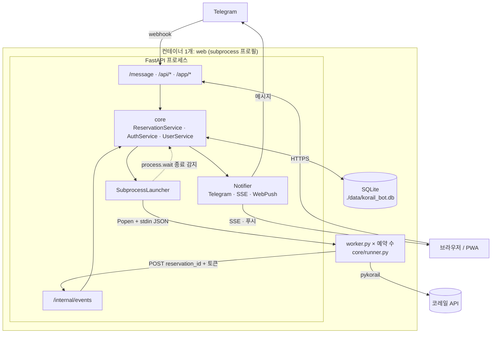
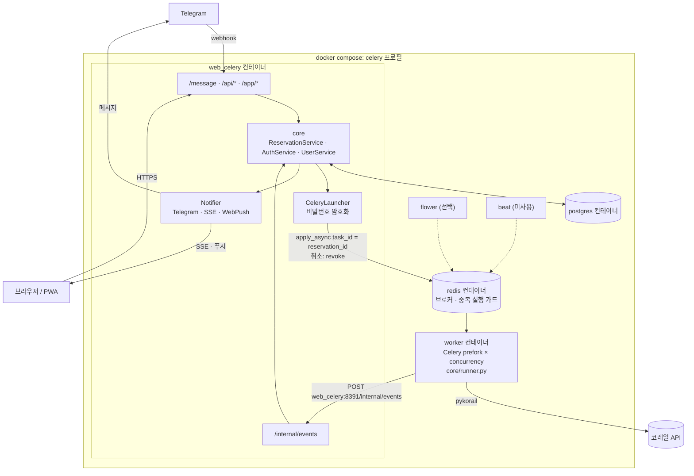

# 실행 모드별 처리량 검토 (Subprocess vs 메시지큐)

| 항목 | 내용 |
|---|---|
| 작성일 | 2026-09-26 (KST) |
| 측정일 | 2026-09-26 (KST) |
| 대상 커밋 | `13e8b1d` (pykorail 병합 + 워커 경량화 이후) |

> 수치는 측정 당시 코드와 환경 기준입니다. 워커 구조, 코레일 클라이언트(pykorail) 버전, 서버 사양이 바뀌면 다시 측정해야 합니다.

## 1. 결론 요약

- **Subprocess 모드로 개인 서버·소규모 그룹 운영에 충분합니다.** 한계는 CPU가 아니라 메모리이며, 예약 1건당 약 **22MB**(PSS)가 듭니다.
- 동시 예약 200건에서도 CPU는 코어 1개의 **6.8%**, 재시도 간격은 설계값(2초 + 응답 시간)대로 유지되고, API 응답 지연도 변하지 않았습니다.
- 웹 서버(단일 프로세스, SQLite)는 워커 보고를 초당 230~370건 처리합니다. 예약 200건에 필요한 양은 초당 약 1.4건이라 **병목이 아닙니다.**
- 메시지큐(Celery) 모드는
  - **prefork**(현재 compose 설정): Subprocess보다 메모리를 더 쓰고, 예약이 없어도 슬롯 수만큼 미리 점유합니다. 동시 실행 수 기본값이 CPU 코어 수라서 2코어 서버에서는 동시에 2건만 실행됩니다.
  - **threads**: 200건에 125MB로 매우 가볍지만, **취소가 동작하지 않습니다**(아래 5절).
- **두 모드의 실제 한계는 코레일입니다.** 예약 200건이면 IP 하나에서 초당 약 74건을 요청하므로, 서버 자원보다 코레일의 매크로 차단(-2000)에 먼저 걸릴 가능성이 높습니다. 메시지큐의 실질적인 장점은 워커를 **여러 서버(여러 IP)로 나눌 수 있다**는 점입니다.

**권장:** 원래 목적(각자 서버에서 가볍게 운영)에는 Subprocess 모드를 기본으로 쓰고, 메시지큐는 여러 서버로 부하를 나눌 필요가 있을 때만 사용합니다.

## 2. 서버 크기별 동시 예약 수 (Subprocess 모드)

OS와 웹 서버 몫으로 약 350MB를 빼고 예약 1건당 22MB로 계산한 값입니다.

| 서버 RAM | 동시 예약 수 (약) |
|---|---|
| 1GB | 30 |
| 2GB | 75 |
| 4GB | 170 |

현재 기본값 `MAX_CONCURRENT_RESERVATIONS=10`이 이보다 먼저 막으므로, 서버 RAM에 맞춰 올리는 것을 권장합니다. 예약 하나는 최대 1000회(약 45분) 시도 후 종료되므로, 동시 슬롯 하나로 하루에 수십 건의 예약 작업을 처리할 수 있습니다.

## 3. 측정 방법

| 항목 | 내용 |
|---|---|
| 환경 | 4코어 / 16GB 컨테이너, Python 3.13 |
| 웹 서버 | 실제 FastAPI 앱 (`web.factory.create_app`), uvicorn 단일 프로세스, SQLite 파일 DB |
| 워커 | 실제 `telegramBot.worker` / `reservation_task` + `core/runner.py`, 운영 설정(간격 2초, 1000회, 50회마다 보고) |
| 코레일 | 모의 서버: 응답 지연 0.7초, 열차 20개 JSON(약 8KB). 워커는 pykorail과 같은 curl_cffi 세션(브라우저 위장 포함)으로 호출 |
| 부하 | 사용자별 로그인 후 예약을 단계적으로 증가(동시 요청) → 모두 `running`이 된 뒤 45초간 측정 |
| 동시 측정 | 20개 클라이언트가 10초간 `GET /api/reservations` 반복, 100개 SSE 연결 유지 |
| 메모리 | 워커 프로세스들의 PSS 합계(공유 메모리를 나눠 계산) 및 RSS 합계 |

실제 코레일은 부하 대상에서 제외했습니다. 2026-09-26에 pykorail로 실제 열차 조회를 확인한 결과 응답 시간은 약 0.7초였습니다(이 환경의 프록시 경유, 첫 요청은 역 목록 조회 포함 약 3초). 실제 코레일 응답의 파싱·TLS 비용과 코레일의 요청 제한은 측정하지 않았습니다.

## 4. 결과

### 4.1 Subprocess 모드

| 동시 예약 | 워커 PSS 합계 | 워커 RSS 합계 | 워커 CPU (코어 1개 기준) | 초당 조회 | 평균 재시도 간격 | 전체 시작 시간 | 예약 생성 p95 | API p95 |
|---|---|---|---|---|---|---|---|---|
| 10 | 227MB | 372MB | 0.3% | 3.6 | 2.82초 | 1.3초 | 0.7초 | 118ms |
| 50 | 1,086MB | 1,861MB | 1.6% | 18.0 | 2.78초 | 2.8초 | 2.2초 | 120ms |
| 100 | 2,156MB | 3,723MB | 3.6% | 36.7 | 2.72초 | 3.6초 | 2.8초 | 129ms |
| 200 | 4,297MB | 7,444MB | 6.8% | 73.7 | 2.71초 | 8.9초 | 8.0초 | 130ms |

- 웹 서버 RSS는 115~130MB로 거의 변하지 않았습니다.
- 200건 일괄 취소는 2.6초가 걸렸고, 취소 후 남은 워커 프로세스는 0개였습니다.
- "예약 생성 p95"는 해당 단계의 예약을 **한꺼번에** 요청했을 때의 값입니다. 요청이 몰리면 느려지는 원인은 7절 1번 항목을 참고하세요.

**워커 경량화 전후 비교** (모두 2026-09-26 측정, 경량화 전은 커밋 `963c20e`에서 코레일 지연 0.25초로 측정):

| 동시 예약 | 경량화 전 PSS | 경량화 후 PSS |
|---|---|---|
| 10 | 650MB | 227MB |
| 50 | 3,172MB | 1,086MB |
| 100 | 6,321MB | 2,156MB |

경량화 전에는 `telegramBot/__init__.py`가 봇 모듈을 import해서, 워커마다 python-telegram-bot·설정·httpx까지 로드했습니다(워커 1개 약 86MB → 약 30MB, 커밋 `13e8b1d`).

### 4.2 Celery prefork (concurrency 100)

| 동시 예약 | 워커 PSS 합계 | 워커 RSS 합계 | 워커 CPU | 초당 조회 | 평균 재시도 간격 | 예약 생성 p95 | API p95 |
|---|---|---|---|---|---|---|---|
| 10 | 3,341MB | 6,317MB | 0.6% | 3.6 | 2.82초 | 0.5초 | 113ms |
| 50 | 3,435MB | 6,541MB | 2.3% | 17.8 | 2.82초 | 0.6초 | 123ms |
| 100 | 3,552MB | 6,820MB | 4.0% | 35.6 | 2.81초 | 0.7초 | 124ms |

- 예약 수와 관계없이 슬롯 100개만큼 메모리를 미리 점유합니다(프로세스 101개).
- 100건 기준 Subprocess(2.16GB)의 약 1.6배이며, 여기에 Redis와 PostgreSQL 컨테이너가 추가됩니다.
- 예약 생성은 큐에 메시지만 넣으므로 요청이 몰려도 빠릅니다.

### 4.3 Celery threads (concurrency 200)

| 동시 예약 | 워커 PSS | 워커 RSS | 워커 CPU | 초당 조회 | 평균 재시도 간격 | 예약 생성 p95 | API p95 |
|---|---|---|---|---|---|---|---|
| 10 | 72MB | 89MB | 0.6% | 3.6 | 2.82초 | 0.5초 | 118ms |
| 50 | 85MB | 102MB | 2.5% | 18.6 | 2.69초 | 0.5초 | 129ms |
| 100 | 98MB | 116MB | 4.8% | 35.6 | 2.81초 | 0.5초 | 127ms |
| 200 | 125MB | 142MB | 9.3% | 74.7 | 2.68초 | 1.1초 | 124ms |

- 프로세스 1개로 동작하며 예약 1건당 추가 메모리는 약 0.3MB입니다.
- 한 프로세스에 모든 예약이 들어 있으므로, 프로세스가 죽으면 진행 중인 예약이 모두 중단됩니다.

### 4.4 웹 서버 워커 보고 처리량

`/internal/events`에 진행 보고(DB 갱신 + 알림)를 동시에 보낸 결과입니다.

| 동시 요청 | 초당 처리 | p50 | p95 |
|---|---|---|---|
| 10 | 372 | 26ms | 41ms |
| 50 | 229 | 148ms | 644ms |

예약 1건은 약 2분 20초(50회 시도)마다 한 번 보고하므로, 동시 예약 200건에 필요한 처리량은 초당 약 1.4건입니다.

## 5. Celery threads 풀의 취소 문제

threads 풀은 `revoke(terminate=True)`를 지원하지 않습니다.

- 200건을 일괄 취소하자 DB에는 모두 `cancelled`로 기록됐지만, 이후 15초 동안 코레일 조회가 초당 76건으로 **취소 전과 같이 계속**됐습니다.
- Celery 로그: `NotImplementedError: <class 'celery.concurrency.thread.TaskPool'> does not implement kill_job`

threads 풀을 쓰려면 워커가 Redis의 취소 표시를 확인해 스스로 멈추는 협력 취소가 필요합니다. 예를 들어 `CeleryLauncher.cancel()`이 `reservation_task:{id}`에 취소 상태를 기록하고, `run_reservation(should_stop=...)`이 이를 확인하는 방식입니다.

## 6. 모드별 아키텍처

### Subprocess 모드

### Celery(메시지큐) 모드

## 7. 검토 중 발견해 수정한 문제

| 수정일 | 문제 | 영향 | 커밋 |
|---|---|---|---|
| 2026-09-26 | 세션 확인 시 DB 연결을 잡은 채 하나를 더 잡음(중첩 세션) | 요청이 몰리면 연결 풀이 고갈돼 30초 후 실패 (예약 50건 동시 생성에서 재현) | `963c20e` |
| 2026-09-26 | `telegramBot/__init__.py`가 봇 모듈을 import | 워커 1개당 메모리 약 3배 | `13e8b1d` |
| 2026-09-26 | 설정 검증 오류 메시지에 환경변수 값이 그대로 출력 | 필수 설정 누락 시 비밀번호가 로그에 노출 | `13e8b1d` |

## 8. 남은 개선 과제 (2026-09-26 기준)

1. **요청이 몰릴 때 예약 생성 지연:** 예약 생성 API가 프로세스 실행과 DB 작업을 이벤트 루프에서 직접 수행해, 동시 요청 100건에서 p95 8초가 걸립니다. 실행 부분을 스레드로 옮기면(`asyncio.to_thread`) 해결됩니다.
2. **보고가 거부된 워커가 멈추지 않음:** 웹 서버가 예약을 모르거나 이미 종료된 예약이라고 응답해도(404/403, `applied: false`), 워커는 최대 1000회까지 코레일을 계속 호출합니다. 측정 중 웹 서버를 재시작하면서 DB를 새로 만들었을 때, 이전 워커 23개가 부모 없이 남아 계속 조회하는 것을 확인했습니다.
3. **Celery 설정:** compose의 워커에 `--concurrency`를 명시하거나, threads 풀과 협력 취소(5절)를 함께 적용해야 합니다.
4. **동시 예약 한도:** `MAX_CONCURRENT_RESERVATIONS`를 서버 RAM에 맞춰 정하는 기준(2절)을 설정 문서에 반영합니다.
